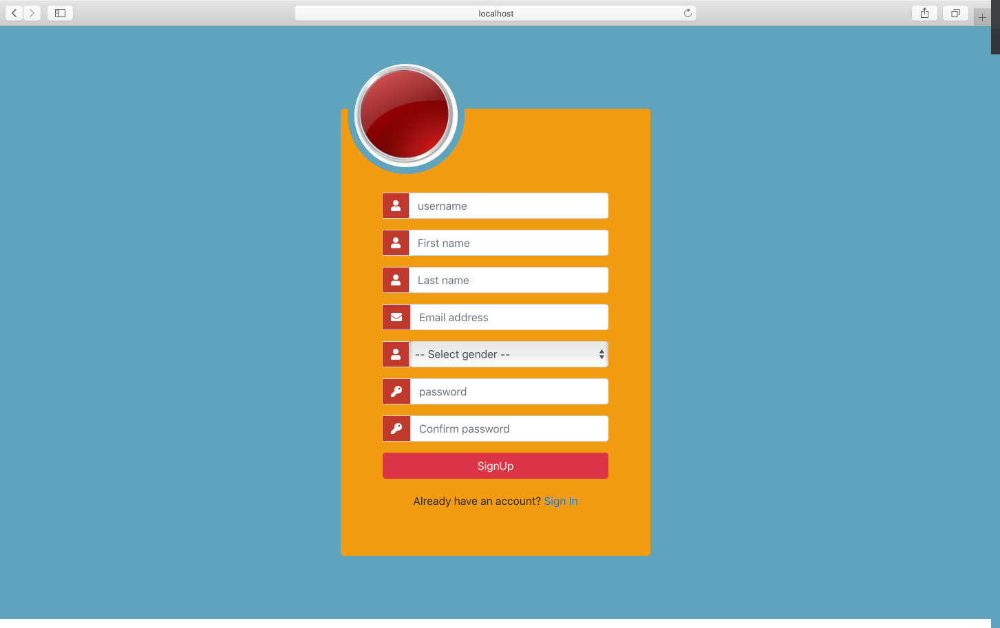
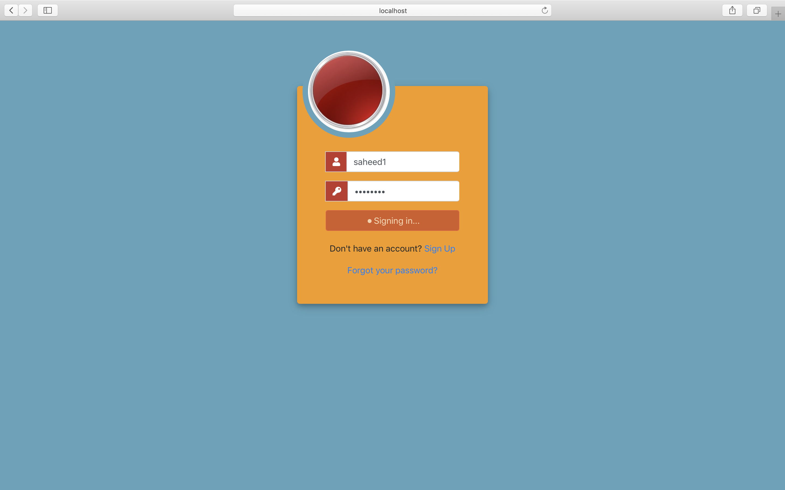
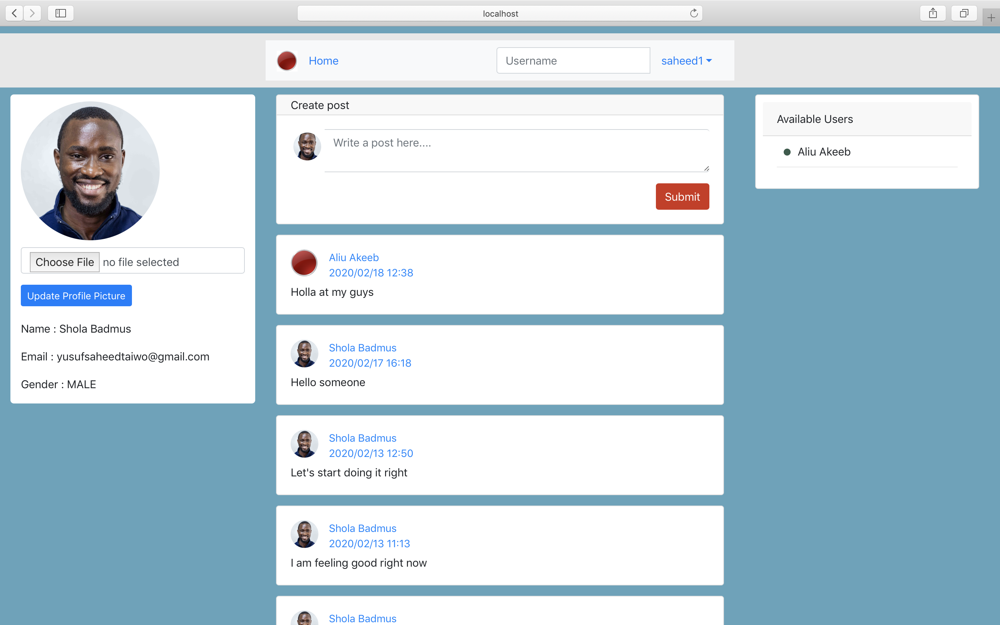
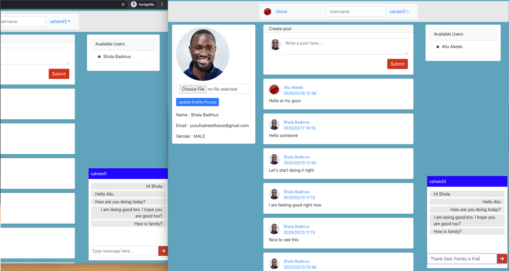
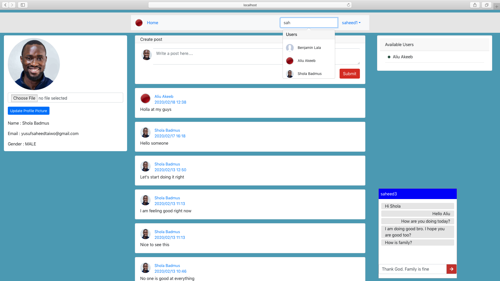
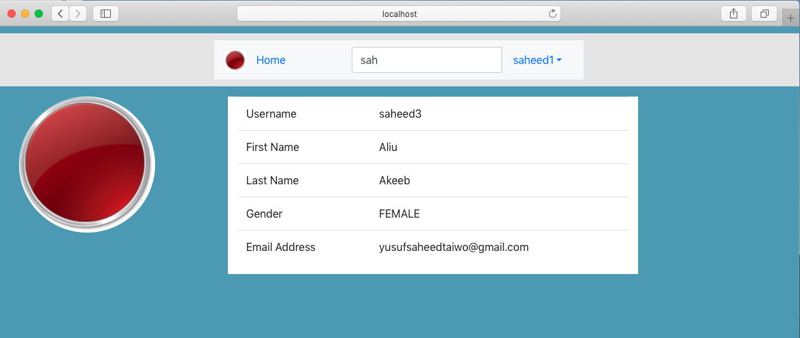

# Mini social app

This is a mini social app built using Javascript technologies. The frontend framework used for this project is React and Nodejs is used for the backend (https://github.com/zeedt/express-social-app-service). 

This application contains series of actions like login, signup, adding a post, comment, chatting, user search and viewing user profile.

This repository contains the React codebase for the app. This react project makes use of **SocketIo Client** for real time chat with other users. 

# Application screenshots

## 1. Signup page

## 2. Login page

Oauth2 authentication is used to handle authentication for this project. The bearer token is stored on the client side using localstorage.

## 3. Landing page / Home Page

The image above is the landing page. The first part of the page contains the information of the user that logged in. 

The second part consists of posts posted by users. Each post has the post content, time posted, who posted it, and avatar.

The third part has a list showing the list of current online users. User can click any of the user listed ro start a converstaion. 

## 4. Chat Box View

The image above shows the ongoing chat between two users that are online. This is a realtime chat.

## 5. User Search Navigation Bar

User can search for other users on the navigation bar using first name, last name or username.

## 6. User information view

User information can be viewed based on the selected user after search.